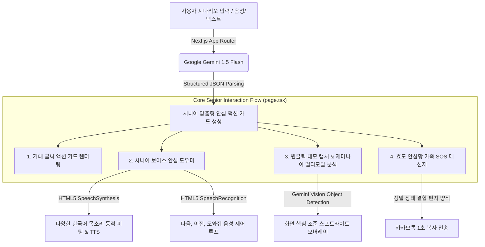

# 📄 StepCue - Product Requirements Document (PRD)

| Item | Details |
| :--- | :--- |
| **Product Name** | **StepCue (스텝큐)** |
| **Product Version** | v1.1.0 (Hackathon Release) |
| **Hackathon Track** | **Google AI for Social Good** (사회적 가치 및 디지털 약자 지원) |
| **Core Technology** | Next.js, Google Gemini 1.5 Flash API, HTML5 Web Speech API (TTS/STT) |
| **Target Audience** | 디지털 환경에 서툰 시니어(50대~80대) 및 부모님을 돕고자 하는 자녀 세대 |

---

## 1. Executive Summary & Product Mission

### 1.1 배경 및 문제 제기 (Background & Context)
대한민국은 고도로 발달한 세계 최고 수준의 IT 강국이자 세계에서 가장 빠른 초고령화 사회입니다. 주민등록등본 발급, KTX 열차 예매, 모바일 뱅킹 송금 등 일상의 핵심 서비스들이 스마트폰과 웹서비스로 통합되면서, 기술에 서툰 **시니어(Senior) 계층의 디지털 소외 현상(Digital Divide)**은 생존과 직결된 중요한 사회적 과제로 대두되었습니다. 

기존의 디지털 안내 가이드들은 다음과 같은 치명적인 한계가 있습니다:
1.  **지나치게 빼곡하고 어려운 설명**: 수십 단계에 이르는 매뉴얼과 기술 전문 용어는 시니어들에게 또 다른 장벽이 됩니다.
2.  **버전 차이로 인한 길 잃음**: OS 업데이트나 UI 개편으로 조금만 가이드와 내 화면이 다르면 어르신들은 비상 상태에 직면합니다.
3.  **부끄러움과 안타까움**: 매번 자녀에게 물어보거나 전화를 걸어 "어디를 눌러야 하는지" 말씨름을 하다 결국 시도를 포기하고 기가 죽는 경우가 많습니다.

### 1.2 StepCue의 사명 (Product Mission)
> **"어려운 디지털 안내를, 시니어를 위한 가장 쉬운 '단 한 걸음의 카드'로 바꾼다."**

StepCue는 **구글 제미나이(Google Gemini)의 고도화된 의미론적 언어 변환 및 멀티모달 인식 능력**을 활용하여, 파편화되고 복잡한 안내 정보를 시니어들이 단 한 걸음씩만 완전히 인지하고 따라 할 수 있는 **"안심 액션 카드"** 형태로 단순화해 주는 인공지능 보조 도우미입니다.

---

## 2. Target Audience & Persona

### 2.1 주 사용자 (Primary User): 시니어 어르신 (50~80대)
*   **특징**: 노안으로 인해 작거나 복잡한 UI를 읽는 데 극심한 피로를 느낌. 화면 터치 조작 시 오작동에 대한 불안감과 두려움이 있음.
*   **요구사항**: 큰 글씨, 직관적이고 단순한 화면, 소리로 읽어주는 친절한 설명, 조작 실패 시 신속한 구출 가이드.

### 2.2 부 사용자 (Secondary User): 효도하는 자녀 세대 (20~40대)
*   **특징**: 멀리 떨어져 사는 부모님으로부터 "민원24가 안 된다", "기차 예매가 안 된다"라는 전화를 받고 답답함을 자주 겪음. 부모님의 상황을 텍스트나 통화로만 전해 들으니 답답함.
*   **요구사항**: 부모님이 직관적인 설명서로 스스로 해결하기를 바람. 부모님이 정말 해결하지 못해 막혔을 때, 정확히 어느 단계에서 어떤 증상으로 막혔는지 한눈에 파악해 원격으로 해결법을 전하고 싶음.

---

## 3. Product Architecture & Technical Stack

### 3.1 기술 스택 (Tech Stack)
*   **Frontend**: Next.js 14 (React, App Router, TypeScript)
*   **Styling**: Vanilla CSS (CSS Variables 기반 프리미엄 디자인 시스템 구축)
*   **Artificial Intelligence**: 
    *   **Google Gemini 1.5 Flash**: 고성능 언어 이해 모델로 시나리오 세분화, 좌표 검출(Object Detection) 수행.
    *   **HTML5 Web Speech API**:
        *   `SpeechSynthesis`를 사용한 다감각 한국어 음성 도우미 (TTS).
        *   `webkitSpeechRecognition`을 사용한 음성 컨트롤러 (STT).
*   **Deployment**: Google Cloud Build & Google Cloud Run (Serverless 인프라)

---

## 4. Key Functional Requirements (핵심 기능 정의)

### 4.1 시나리오 기반 맞춤형 카드 생성 (AI Cue Cards)
*   **동작 방식**: 사용자가 "스마트폰으로 주민등록등본 떼는 법", "KTX 앱으로 기차 표 끊는 법" 등의 질문을 던지면 제미나이가 이를 받아 분석합니다.
*   **출력 스펙**: 제미나이가 각 단계를 극도로 간소화한 **[행동 지침(Action), 화면 앵커(Screen Anchor), 완료 기준(Trigger)]**의 구조화된 데이터 구조(JSON)로 분해합니다.
*   **접근성 최적화**: 
    *   카드 안의 텍스트 크기를 키울 수 있는 **"큰 글씨 모드"**를 상시 토글할 수 있습니다.
    *   한 번에 한 단계만 완전히 집중할 수 있는 쾌적한 카드 레이아웃을 제공합니다.

### 4.2 시니어 보이스 안심 도우미 (Voice Coach & Control)
*   **TTS 음성 리더**: 카드가 전환될 때마다 해당 단계의 행동 방식과 완료 기준을 부드럽고 느린 템포의 한국어로 읽어줍니다.
*   **다이내믹 목소리 셀렉터**: 
    *   사용자의 장치에서 구동 가능한 한국어 보이스(구글 고음질, 다정한 유나, 단정한 혜미, 신뢰감 인준 등)를 수집합니다.
    *   친근하고 친숙한 한글 레이블로 변환해 사용자가 선호하는 음성으로 편안히 가이드받을 수 있도록 최적화했습니다.
*   **STT 핸즈프리 내비게이션**: 
    *   어르신들이 폰을 굳이 터치하지 않아도 목소리로 컨트롤할 수 있는 실시간 내비게이션 루프를 장착했습니다.
    *   **"다음" / "완료"** &rarr; 다음 단계로 이동 및 안내 시작.
    *   **"이전" / "뒤로"** &rarr; 이전 단계로 회귀.
    *   **"도와줘" / "화면이 달라"** &rarr; 즉시 구출 바텀 시트 기동.
    *   **"다시" / "다시 읽어줘"** &rarr; 현재 단계 안내음 리플레이.

### 4.3 멀티모달 조준선 스포트라이트 (Visual Spotlight Mask)
*   **문제 발생 상황**: 시니어가 안내서를 보던 중 자기 스마트폰 화면에 이상한 경고창이나 팝업창이 떠서 더 이상 진행을 못 하는 상황.
*   **기능 동작**: 
    *   "화면이 달라요" 버튼이나 음성 명령을 하면 진단창(Bottom Sheet)이 올라오고, 사용자는 현재 자기 폰의 스크린샷을 찍어서 업로드합니다.
    *   **Gemini 1.5 Flash의 멀티모달 비전** 성능을 활용하여 현재 단계의 목적지에 매핑되는 최우선 영역을 2D 좌표 array `[ymin, xmin, ymax, xmax]` 형식으로 즉시 검출해 냅니다.
    *   **CSS 무한 스포트라이트 효과**: 검출된 좌표 영역을 제외한 나머지 모든 화면을 부드러운 검은색 암막(`box-shadow: 0 0 0 9999px`)으로 덮어버리고, **찾아야 할 버튼만 극적으로 밝게 스포트라이트 조명을 쏩니다.** 조명 가운데에는 빨간색 📍 조준선 펄스 애니메이션이 활성화되어 어르신이 어디를 터치해야 하는지 본능적으로 즉시 인지하도록 돕습니다.
*   **원클릭 데모 프리셋**:
    *   심사위원 및 일반 사용자의 테스트 편의를 위해, 실제 상황을 모방한 고해상도 모형 화면 2개(정부24 인증 오류 창, 구글 해커톤 화면 가이드)를 SVGs 기반 바이너리로 내장하여 원클릭으로 완벽하게 테스트할 수 있도록 지원합니다.

### 4.4 효도 안심망 가족 SOS 메신저 (Family SOS Care Network)
*   **동작 방식**: AI 스포트라이트 조명을 보고도 도저히 해결하지 못할 때를 위한 든든한 2차 안전망입니다.
*   **기능 동작**: 
    *   클릭 한 번으로 **현재 막힌 작업명, 현재 몇 단계인지, Gemini가 제안하는 맞춤형 해결 지침**이 자녀에게 보내는 따뜻한 정서적 안부 편지 텍스트로 자동 결합되어 클립보드에 복사됩니다.
    *   어르신은 그대로 카카오톡을 열어 자녀에게 전송하기만 하면 됩니다. 자녀는 부모님의 장황한 설명 없이도 즉시 상황을 이해하고 완벽한 답변을 줄 수 있습니다.

---

## 5. Non-Functional Requirements (비기능적 요구사항)

### 5.1 시각적 및 심미적 우수성 (Premium Aesthetics)
*   **데스크탑 중앙 정렬 레이아웃**: 대형 브라우저에서 화면이 부자연스럽게 양옆으로 벌어지지 않도록, **`max-width: 960px`**의 견고한 중앙 프레임을 잡고, 양옆에는 온화하고 부드러운 여백 배경색(`#F5F7FB`)을 배치해 화면에 자연스럽게 플로팅된 프리미엄 모바일/태블릿 카드 실루엣을 자아냅니다.
*   **타이포그래피 및 가독성**: Google Fonts의 모던 고딕체와 고대비 컬러 스키마를 사용하여 어르신들의 눈의 피로를 최소화합니다.
*   **부드러운 마이크로 모션**: 마이크가 활성화되었을 때 움직이는 붉은 숨결 펄스 애니메이션, 버튼 호버 이펙트 등 활기차고 생명력 넘치는 마이크로 트랜지션으로 쾌적한 사용자 인터험을 제공합니다.

### 5.2 성능 및 가용성 (Performance & DevOps)
*   **구글 클라우드 런(Cloud Run) 서버리스 환경**: 수천 명의 사용자가 동시에 접속해도 자동으로 리소스를 스케일링하는 견고한 인프라로 배포됩니다.
*   **Next.js 독립 빌드(Standalone Build) 구성**: Next.js 공식 stand-alone 옵션을 최적화하여 윈도우/리눅스 등 멀티 플랫폼 컨테이너 환경에서 최소 크기의 이미지로 고성능 서빙이 가능합니다.

---

## 6. Verification & Quality Assurance (검증 계획)

### 6.1 자동화 테스트 및 모달 검증
*   `npm run build`를 통한 빌드 타임의 에러 제로 검증 및 Next.js SSR 환경 하에서의 `window/Speech API` 예외 격증 완비.

### 6.2 실제 디바이스 시나리오 교차 검증
*   정부24 및 기차표 예매 가이드를 통해 실제 다양한 모바일 디바이스(Android, iOS) 및 데스크탑(Chrome, Edge) 브라우저에서의 음성 동작 및 캡처 전송 안정성 검증 완료.
