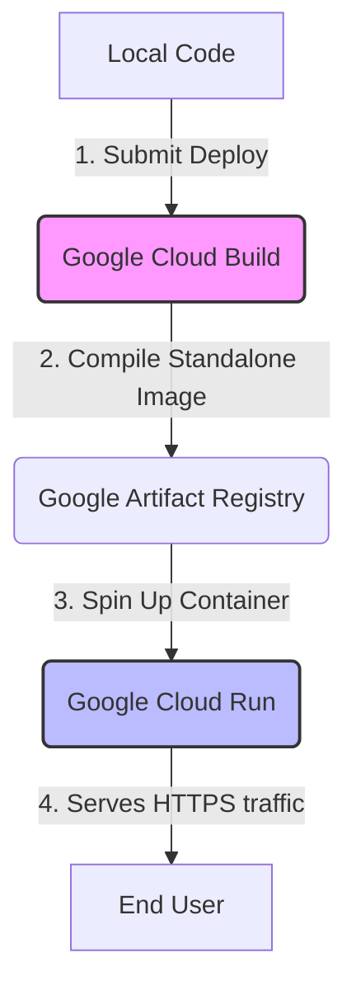

# StepCue Google Cloud Run Deployment Guide

This guide walks you through deploying the **StepCue** Next.js application to **Google Cloud Run** using **Google Cloud Build**.

Since StepCue is already configured for Next.js standalone output and includes a production-ready `Dockerfile`, deploying to Google Cloud Run is highly efficient, robust, and cost-effective.

---

## Architecture Overview



- **Google Cloud Run**: A fully managed serverless platform that automatically scales containerized applications up or down (including to zero instances when there is no traffic) so you only pay for actual compute used.
- **Google Cloud Build**: An server-side compilation platform. This means **you do not need Docker installed locally** to build and run the container—Google Cloud builds it for you.
- **Google Artifact Registry**: A secure place to host build artifacts and container images.

---

## Step 1: Install the Google Cloud CLI (gcloud)

To run deployment commands and scripts, you need the Google Cloud CLI (`gcloud`) installed on your computer.

### Windows (PowerShell / Command Prompt)
1. Download the [Google Cloud CLI Windows Installer](https://dl.google.com/dl/cloudsdk/channels/rapid/GoogleCloudSDKInstaller.exe).
2. Run the installer and follow the instructions.
3. Ensure the option to **"Start Google Cloud CLI Shell"** or **"Add to PATH"** is selected.
4. Open a new PowerShell terminal and verify installation:
   ```powershell
   gcloud --version
   ```

### macOS
Use Homebrew:
```bash
brew install --cask google-cloud-sdk
```

### Linux (Debian / Ubuntu)
```bash
sudo apt-get update && sudo apt-get install apt-transport-https ca-certificates gnupg curl
echo "deb [signed-by=/usr/share/keyrings/cloud.google.gpg] https://packages.cloud.google.com/apt cloud-sdk main" | sudo tee -a /etc/apt/sources.list.d/google-cloud-sdk.list
curl https://packages.cloud.google.com/apt/doc/apt-key.gpg | sudo gpg --dearmor -o /usr/share/keyrings/cloud.google.gpg
sudo apt-get update && sudo apt-get install google-cloud-cli
```

---

## Step 2: Initialize Google Cloud CLI

1. Open your terminal or PowerShell and run the login command:
   ```bash
   gcloud auth login
   ```
   *This opens a browser window where you can log in with your Google account.*

2. Configure billing on your Google Cloud Console if you haven't already:
   - Go to [Google Cloud Billing Console](https://console.cloud.google.com/billing).
   - Ensure a billing account is linked to your Google Cloud project. (Google Cloud Run has a very generous free tier, but billing must be enabled to run build operations).

---

## Step 3: Run the Automated Deployment

We have created two deployment scripts to completely automate the setup, resource creation, image building, and deployment.

### On Windows (PowerShell)
Execute the PowerShell deployment script:
```powershell
./deploy.ps1
```
> [!NOTE]
> If PowerShell blocks script execution, run: `Set-ExecutionPolicy -Scope Process -ExecutionPolicy Bypass` first, then run `./deploy.ps1`.

### On macOS / Linux / Git Bash
Run the Bash deployment script:
```bash
chmod +x deploy.sh
./deploy.sh
```

### What these scripts do under the hood:
1. Verify `gcloud` installation and active account.
2. Select or prompt for your target **Google Cloud Project ID**.
3. Enable required services: Artifact Registry, Cloud Build, and Cloud Run APIs.
4. Create a Docker repository named `stepcue-repo` in Artifact Registry (region: `us-central1`).
5. Submit the local source code to Cloud Build using [cloudbuild.yaml](file:///d:/StepCue/cloudbuild.yaml), which compiles the image and deploys it to Cloud Run.

---

## Step 4: Configuring Environment Variables (e.g. `GEMINI_API_KEY`)

Since StepCue integrates with Gemini via `@google/genai`, you must set your `GEMINI_API_KEY` for the backend to function.

There are two ways to set this:

### Option A: Using the Google Cloud Run Console (Easiest)
1. Go to the [Google Cloud Run Console](https://console.cloud.google.com/run).
2. Click on your service: **`stepcue`**.
3. Click **EDIT & SELECT NEW REVISION** at the top.
4. Scroll down to the **Variables** tab.
5. Click **Add Variable**:
   - **Name**: `GEMINI_API_KEY`
   - **Value**: *Your actual Gemini API Key*
6. Click **Deploy**.

### Option B: Using the CLI
Run the following command to update your service with the environment variable:
```bash
gcloud run services update stepcue \
    --region=us-central1 \
    --set-env-vars="GEMINI_API_KEY=your_gemini_api_key_here"
```

---

## Step 5: Setting Up a Custom Domain (Optional)

To serve StepCue under your own custom domain (e.g., `app.stepcue.com`), Google Cloud Run makes it simple:

1. In the Cloud Run Console, click **MANAGE CUSTOM DOMAINS** at the top.
2. Click **ADD MAPPING**.
3. Select the service (`stepcue`) and enter your domain name.
4. Google Cloud will generate **DNS TXT and CNAME/A records** for you.
5. Update your domain registrar's DNS settings with these values. Google will automatically provision a free SSL certificate for you.

---

## Continuous Integration & Deployment (CI/CD)

Once your initial deployment is successful, you can set up automatic deployments whenever you push to GitHub:
1. Go to the [Cloud Run Console](https://console.cloud.google.com/run).
2. Click **SET UP CONTINUOUS DEPLOYMENT**.
3. Authenticate with GitHub, select your StepCue repository, and specify your main branch.
4. Select **Google Cloud Build (with Dockerfile)** or point to your `cloudbuild.yaml`.
5. Save! Now every push to your repository will automatically trigger a new deployment.
